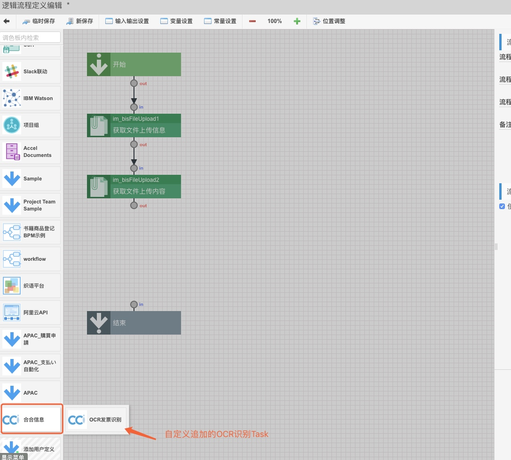

<p align="center"><font size="6" ><strong>Intra-mart实战之OCR发票识别</strong></font></p>
<p align="center">&nbsp; &nbsp;  作者：kenny &nbsp; &nbsp; 时间：2019/05/06</p>

-------

#### 什么是OCR？
OCR技术是光学字符识别的缩写(Optical Character Recognition)，是通过扫描等光学输入方式将各种票据、报刊、书籍、文稿及其它印刷品的文字转化为图像信息，再利用文字识别技术将图像信息转化为可以使用的计算机输入技术。

#### 为什么用Intra-mart来实现OCR发票识别功能？
使用[Intra-mart](http://www.intra-mart.com.cn/product/product/display/id/69/product_type_id/16)(以下简称IM)中间件产品来实现OCR发票识别主要原因有以下几点：
* IM是个稳定并开源的中间件开发平台。
* 提供很多开箱可用的功能以及各种API接口。
* 提供在线无代码开发工具，可快速实现自己想要的功能。
* 学习门槛比较低、上手很快。

#### 怎么样在IM上通过OCR来识别发票？
将发票拍照或扫描成图片，上传到在Web页面上，然后点击识别发票即可获得发票的详细信息。话不多说，我们直接看效果。


发票上传页面截图
发票支持jpg、jpeg、png等格式图片。
发票上传后可预览发票内容，点击[识别发票]按钮后系统会识别发票将结果返回到下面的列表里。


发票识别结果页面截图
通过OCR识别发票后，会将发票所有的内容都返回回来。
详细返回内容参考：[票据机器人API调用文档](https://ai.ccint.com/doc/api/ocr_common_invoices)


## 具体开发步骤


#### 1、发票上传表单及功能制作
发票上传表单使用[IM-FormaDesinger](https://www-zh.intra-mart.jp/document/library/forma/public/forma_appli_maker_guide/introduction.html)拖拽式在线表单制作工具开发。
该工具可以在线完成以下处理：
* 页面表单制作
* 增删查改逻辑处理自动完成
* 其它逻辑处理程序调用
* 数据库表创建
* 菜单配置
* 访问权限配置

###### 1.1、上传表单制作
打开网站地图->Forma管理画面->应用程序一览


点击[登记]开始创建表单画面。
首先需要填写表单基本信息，如表单ID、表单名、有效开始日期等。


点击[登记]按钮保存后进入表单编辑界面。
拖拽工具箱里的控制到表单相应位置上进行表单制作。
放置[附件上传]、[网格表]、[按钮(事件)]等控件。


放置[标题]控件，设置表单页头，给表单一个标题。


双击[附件上传]控件，设置发票上传后预览高度参数。
[项目识别ID]为该控件的ID，后续发票识别逻辑处理时会用到。
另外这个ID也是数据库建表时使用的字段ID，可以改成更好识别的ID值。


双击[网格表]编辑表格显示列内容级属性
发票识别结果会显示到这个表格里，表格的各列显示顺序可以调整。
点击显示前的行数字拖拽移动就可以改变列的顺序。


点击[更新]保存表单


###### 1.2、数据库表创建
点击[返回]后，下一步创建数据库表。
在这个页面上点击[登记]按钮后系统会自动创建表。
> 注意：字符串型的字段需要手动指定字符串长度。


###### 1.3、权限配置
以下页面可以设置权限，只有设置了权限后用户才能看到该页面。
可以根据身份、用户、部门等设置权限，可以控制是否可以修改。


###### 1.4、菜单配置
这里可以将Forma制作的表单挂到相应的菜单下。
先选择菜单组别，在选中的组别下创建菜单。
点击[登记]按钮后输入菜单名即可追加该页面菜单。


#### 2、OCR发票识别处理逻辑程序制作
本次发票识别处理逻辑程序也是通过在线业务逻辑制作工具[IM-LogicDesinger](https://www-zh.intra-mart.jp/document/library/iap/public/im_logic/im_logic_tutorial_guide/texts/summary/index.html#common-im-logic)开发的。
OCR识别引擎使用的是[合合信息公司](https://www.ccint.com)提供的OCR发票识别技术。非常感谢合合公司同仁提供对接账号。

###### 2.1、主逻辑处理流程制作
打开网站地图->LogicDesinger->流程定义一览


点击[新建]开始创建处理流程。
首先设置处理逻辑的输入参数。
参数为步骤1制作的表单上保存数据时插入数据库的主键。


输入参数可一个个追加也可以通过Json形式批量追加。
与Froma表单对接时以下为固定参数。
上传的发票附件会保存到数据库里，通过以下主键活的数据库里的发票内容即可。
```json
{
  "imfr_application_id": "Forma应用ID",
  "imfr_insert_id": "Forma插入数据ID",
  "imfr_process_key": "Forma处理Key"
}
```


###### 2.2、 获取上传的发票内容

下一步，获取上传的发票文件的ID。
使用系统提供的[获取文件上传信息]Task来获取。
需要先获取到文件ID，通过文件ID再或获取文件内容。


拖拽连线使各个Task串连起来控制逻辑顺序。
实际上这个线没有多大用处。


定义常量，一些固定值可设置在常量里以便作为后续处理Task的参数使用。
这里定义表单上附件上传控件的ID为常量，让后续处理知道获取哪个控件上传的文件。


| 常量ID | 常量值 |
| --- | --- |
| forma_fileupload_item_id | attach_fileupload_item1 |
> 常量值参考1.1的附近上传控件的id

双击[获取文件上传信息]Task，编辑参数传递映射关系。
左边为主流程的参数(2.1里设置的参数)和变量、常量、以及各Task的返回值。右边为当前选中Task的输入参数。参数类型系统会自动转换如日期型的直接传给右边String型的。参数需要加工的可以通过追加函数来完成如参数拼接等操作。


追加获取文件内容Task。
使用是的和文件ID获取相同的Task。


修改Task表示名称。
为便于好识别，将第二个Task的名称修改下。
> 修改前：获取文件上传信息
> 修改后：获取文件上传内容


双击编辑[获取文件上传内容]的参数传递映射关系。
这里除了传递Froma的主键之外，将第1个Task里获取到的文件ID传递给第2个Task。
左边通过[添加输入]选择第1个Task，将第1个的返回值加到左边列里。


###### 2.3、 自定义OCR发票识别Task

OCR发票识别使用的是合合信息的Rest API接口。
相关文档参考：[票据机器人API调用文档](https://ai.ccint.com/doc/api/ocr_common_invoices)
> 该票据机器人API接口无法在线申请测试帐号，需要邮件联系他们公司开通测试账号。开通过程很快，感谢合合信息配合。
> 
> 邮件地址：marketing@intsig.com
> 联系电话：400-608-3063


IM-LogicDesinger提供直接调用Rest API的功能，使用该功能无需写代码可完成调用第三方接口。使用是的[添加用户定义]里的[REST定义新建]。


在弹出的REST定义编辑画面创建新的Task。
弹出的REST定义编辑画面里填写信息如下：
> 用户类别新建个合合信息类别


JSON格式输入值：
> 参数中的app_key，app_secret为合合信息的密钥。
> 从API的控制台里可获取，获取后可提前定义到常量里。
> image_data为发票图片Base64格式数据。
> body结构是POST方式提交时需要将参数放到body里。

```json
{
  "app_key": "",
  "body": {
    "image_data": "",
    "app_secret": ""
  }
}
```


JSON格式返回值：
返回值里body<object>可以编辑，body里定义OCR API的返回格式。
参考：[功能演示-JSON结果](https://ai.ccint.com/api/vision/ocr_common_invoices)

```json
{
  "code": 0,
  "message": "",
  "result": {
    "rotated_image_width": 0,
    "rotated_image_height": 0,
    "image_angle": 0,
    "type": "",
    "ocr_data_list": [
      {
        "key": "",
        "value": "",
        "description": ""
      }
    ]
```
请求信息如下


```
终点：https://ocr-api.ccint.com/ocr_service?app_key=${app_key}
方法：POST
请求类别：application/json
请求编码：UTF-8
请求Header：追加 
            Header名：content-type 
            Header值：application/json
响应类别：json
响应编码：UTF-8
```


保存后会多出个自定义Tast组别。如:合合信息
合合信息组别下会多个刚刚创建的OCR发票设别Task。


将[OCR发票识别]Task添加到流程里，设定[OCR发票识别]Task的参数映射关系。
左加追加第2个Task获取的文件内容返回值。通过encode函数将二进制文件内容转换后传递给image_data。
> 参数image_data接收的BASE64的图片数据，
> 需要将[获取文件上传内容]Task获取的二进制数据转换成BASE64数据。


###### 2.4、 设置主流程的返回值
主流程的返回值和OCR识别Task的返回值一样。


输出值JSON格式定义：
同[OCR发票识别]Task的返回值一样，可从上面复制JSON格式定义。

```json
{
  "body": {
    "code": 0,
    "message": "",
    "result": {
      "rotated_image_width": 0,
      "rotated_image_height": 0,
      "image_angle": 0,
      "type": "",
      "ocr_data_list": [
        {
          "key": "",
          "value": "",
          "description": ""
        }
      ]
    }
  }
}
```

设置主流程返回值映射关系


最终保存


到此OCR识别处理逻辑就制作完成了，是不是很方便。

#### 3、将OCR识别逻辑定义成外部连接用数据源
将上面作成的OCR识别逻辑定义成外部连接用数据源后，IM-FormaDesinger制作的表单画面可以直接调用这个数据源。这一步主要是为了让IM内部其它应用来调用LogicDesinger作成的处理逻辑。

###### 3.1、数据源定义
打开网站地址->IM-BIS->系统管理员->主表管理->外部连接->数据源定义


点击[登记]按钮开始追加新的数据源
设置基本信息


选择Logic流程


请求参数和响应参数会自动设置


#### 4、绑定表单里的按钮事件
绑定[识别发票]按钮的事件，让[识别发票]按钮触发OCR发票识别处理逻辑程序。
###### 4.1、追加动作设定
添加[识别发票]按钮的点击事件动作。


###### 4.2、动作绑定到OCR识别数据源
添加外部连动动作


选择步骤3点定义好的数据源
> 请求参数不用设置，系统自动会把Forma的相关主键值传递给逻辑流的参数里


设置响应值映射关系
> 左边为OCR识别逻辑流的返回值，右边为表单上的网格表对应的列。
> 每次一个逐个追加对应关系。


到此开发全部完成了。
可以到以下菜单去使用体验


-------
目录

[TOC]
